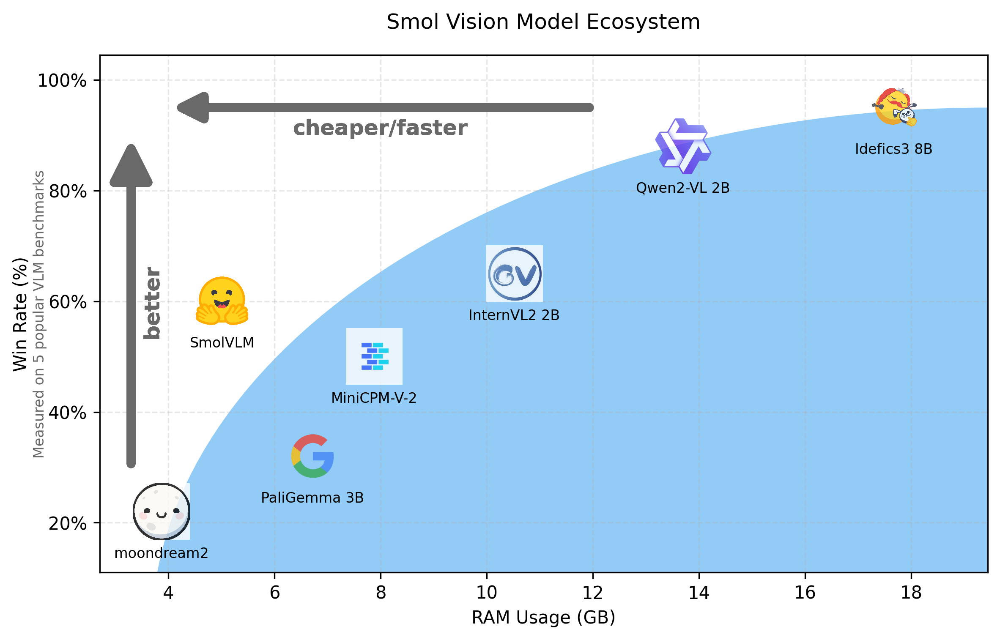

# Document structured extraction

## Literature review

### Open-source LLMs

* Qwen-2.5-VL:
  * Tuned to return JSON
  * Multi-modal (image, video, and **documents**)
  * Supported by vLLM:

An example:

```python
def run_qwen2_5_vl(questions: list[str], modality: str) -> ModelRequestData:

    model_name = "Qwen/Qwen2.5-VL-3B-Instruct"

    engine_args = EngineArgs(
        model=model_name,
        max_model_len=4096,
        max_num_seqs=5,
        mm_processor_kwargs={
            "min_pixels": 28 * 28,
            "max_pixels": 1280 * 28 * 28,
            "fps": 1,
        },
        disable_mm_preprocessor_cache=args.disable_mm_preprocessor_cache,
    )

    if modality == "image":
        placeholder = "<|image_pad|>"
    elif modality == "video":
        placeholder = "<|video_pad|>"

    prompts = [
        ("<|im_start|>system\nYou are a helpful assistant.<|im_end|>\n"
         f"<|im_start|>user\n<|vision_start|>{placeholder}<|vision_end|>"
         f"{question}<|im_end|>\n"
         "<|im_start|>assistant\n") for question in questions
    ]

    return ModelRequestData(
        engine_args=engine_args,
        prompts=prompts,
    )
```

  * Here's how look the Qwen-2.5-VL prompt:
  ```
  <|im_start|>system
  You are a helpful assistant.<|im_end|>
  <|im_start|>user
  <|vision_start|><|image_pad|><|vision_end|>{message}.<|im_end|>
  <|im_start|>assistant
  ```

  * Sources:
    * [HF collections](https://huggingface.co/collections/Qwen/qwen25-vl-6795ffac22b334a837c0f9a5)
    * [Paper](https://arxiv.org/pdf/2502.13923)
    * [Demo](https://huggingface.co/spaces/Qwen/Qwen2.5-VL-72B-Instruct)
  
* SmolVLM & SmolVLM2:
  * Small and memory efficient
  * Not supported by vLLM
  * **Maybe not designed for JSON output**
  
  

  * Sources:
    * https://huggingface.co/blog/smolvlm
    * https://huggingface.co/blog/smolvlm2

* Idefics3
  * Source:
    * [Model page](https://huggingface.co/HuggingFaceM4/Idefics3-8B-Llama3)

* Pixtral
  * [Model page](https://huggingface.co/mistralai/Pixtral-12B-2409)
  * [Blog post](https://mistral.ai/news/pixtral-12b)
  * Structured output possible
  * Supported by vLLM


## Structured ouptut generation

* Structure generation tutorial: [Open-source AI cookbook](https://huggingface.co/learn/cookbook/en/structured_generation_vision_language_models) 
* Library to guide to output genertion: [Outline](https://huggingface.co/learn/cookbook/en/structured_generation_vision_language_models)

## Data

### Invoices:

* https://huggingface.co/datasets/chainyo/rvl-cdip-invoice 
* https://huggingface.co/datasets/mathieu1256/FATURA2-invoices **[Let's take this one]**
* https://universe.roboflow.com/amyf467-gmail-com/invoice-processing


